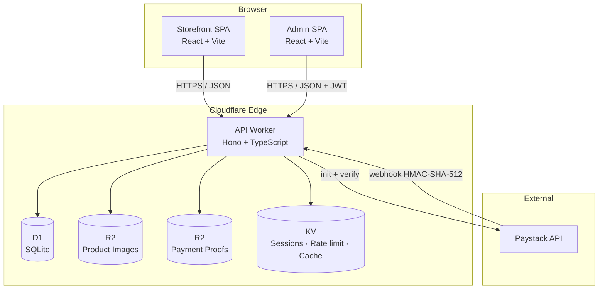

<div align="center">

# Skipper Detergents

**Premium cleaning &amp; bathroom essentials, delivered across Ghana.**

Production-grade e-commerce platform with bulk-quantity pricing, Paystack &amp; manual-transfer checkout, and a lightweight admin CMS — built entirely on Cloudflare's edge.

<br />

[](https://github.com/ghwmelite-dotcom/skipper-detergents/actions/workflows/ci.yml)
[](https://www.typescriptlang.org/)
[](https://workers.cloudflare.com/)
[](https://hono.dev/)
[](https://turbo.build/)
[](https://vitest.dev/)
[](https://pnpm.io/)
[](#license)

</div>

---

## Overview

Skipper Detergents is a Ghanaian household-essentials brand selling its own "Skipper" line alongside trusted brands (Omo, Ariel, Dettol, Softcare, Premier, Bounty, Harpic) — detergents, toilet rolls, tissue, paper towels, and bathroom accessories. This repository is the full commerce platform powering the storefront, admin CMS, and APIs.

Everything is **SEO-first**, **mobile-first**, and runs on the **Cloudflare edge** (Workers + D1 + R2 + KV) so a customer in Accra gets sub-100&nbsp;ms responses and Google's crawler sees fully-hydrated product pages.

## Highlights

| Capability                   | Details                                                                                    |
| ---------------------------- | ------------------------------------------------------------------------------------------ |
| **Bulk ordering**            | Per-product quantity tiers with automatic cart-level discount resolution                   |
| **Dual checkout**            | Paystack (card, mobile money, bank) + manual bank / MoMo transfer with proof upload        |
| **SEO-first**                | JSON-LD structured data, dynamic sitemap, prerendered critical pages, canonical URLs       |
| **Admin CMS**                | Product CRUD with R2 image uploads, order management, manual-payment verification          |
| **Ghana-aware delivery**     | Zoned fees, pickup option, Ghana Post GPS addresses, optional third-party tracking link    |
| **Strong typing end-to-end** | Shared Zod schemas validate client + server; every API boundary is typed                   |
| **Edge-native**              | All compute in Cloudflare Workers; zero origin servers                                     |
| **Accessibility baseline**   | WCAG AA contrast, 44&nbsp;px touch targets, full keyboard navigation, reduced-motion aware |

## Architecture



The storefront and admin are **two independent Cloudflare Pages deployments** so customers never download admin JavaScript and each surface gets its own CSP.

## Tech stack

| Layer            | Choice                                              | Why                                               |
| ---------------- | --------------------------------------------------- | ------------------------------------------------- |
| Monorepo         | pnpm workspaces + Turborepo                         | Fast installs, cached task pipeline               |
| Language         | TypeScript 5.5 (strict, `noUncheckedIndexedAccess`) | Zero `any` policy, surface errors at compile time |
| API framework    | Hono 4 on Cloudflare Workers                        | Edge-native, tiny, first-class TS types           |
| Database         | Cloudflare D1 (SQLite + FTS5)                       | Co-located with compute, no cold connections      |
| Object storage   | Cloudflare R2                                       | Product images, payment-proof uploads             |
| Cache / sessions | Cloudflare KV                                       | JWT blacklist, rate-limit counters, cache layer   |
| Validation       | Zod 3                                               | Same schema on client and server                  |
| Auth             | JWT via `jose` + scrypt password hashing            | No external auth dependency; admin-only in v1     |
| Payments         | Paystack + inline popup SDK                         | Ghana-native card + mobile money + bank           |
| Frontend (m3–m5) | React 18 + Vite + Tailwind + shadcn/ui              | Widely known, fast builds, accessible primitives  |
| Testing          | Vitest 2 + `@cloudflare/vitest-pool-workers`        | Fast, Workers-aware integration tests             |
| CI / CD          | GitHub Actions + Wrangler                           | Deploy on merge to `main`                         |

## Project structure

```
skipper-detergents/
├── apps/
│   ├── storefront/         # Customer-facing React SPA             (milestones 3–4)
│   └── admin/              # Admin CMS React SPA                   (milestone 5)
├── packages/
│   ├── api/                # Hono Worker — routes, middleware, D1
│   │   └── src/db/         # schema.sql · seed.sql · migrations/
│   └── shared/             # Zod schemas · types · constants · utils
├── docs/
│   └── superpowers/
│       ├── specs/          # Approved design specs
│       └── plans/          # Milestone implementation plans
└── .github/workflows/      # ci.yml + deploy.yml
```

## Quick start

Prerequisites: **Node.js 20+**, **pnpm 9+**, a **Cloudflare account** (free tier is enough), and **Wrangler** (installed as a workspace dev-dep — no global install required).

```bash
# 1. Clone and install
git clone https://github.com/ghwmelite-dotcom/skipper-detergents.git
cd skipper-detergents
pnpm install

# 2. Authenticate with Cloudflare (one-time)
pnpm --filter @skipper/api exec wrangler login

# 3. Create your Cloudflare resources (first setup only — copy the printed IDs)
pnpm --filter @skipper/api exec wrangler d1 create skipper-detergents-db
pnpm --filter @skipper/api exec wrangler r2 bucket create skipper-products
pnpm --filter @skipper/api exec wrangler r2 bucket create skipper-payment-proofs
pnpm --filter @skipper/api exec wrangler kv namespace create SESSIONS
pnpm --filter @skipper/api exec wrangler kv namespace create RATE_LIMIT
pnpm --filter @skipper/api exec wrangler kv namespace create CACHE

# 4. Paste the IDs into packages/api/wrangler.toml (replacing PLACEHOLDER_FILL_IN_TASK_17)

# 5. Initialize local D1 with schema + seed data
pnpm --filter @skipper/api db:setup

# 6. Run the API
pnpm --filter @skipper/api dev
# → http://localhost:8787/health
```

## Available scripts

Run from the repo root unless noted:

| Script              | What it does                                           |
| ------------------- | ------------------------------------------------------ |
| `pnpm dev`          | Start every dev server (currently just the API Worker) |
| `pnpm test`         | Run every package's test suite via Turborepo           |
| `pnpm typecheck`    | Strict TS check across the monorepo                    |
| `pnpm lint`         | ESLint on every package                                |
| `pnpm format`       | Prettier write on `**/*.{ts,tsx,md,json,yml,yaml}`     |
| `pnpm format:check` | Prettier check (CI uses this)                          |
| `pnpm build`        | Build every buildable package                          |

Package-specific (`packages/api`):

| Script           | What it does                                       |
| ---------------- | -------------------------------------------------- |
| `db:setup`       | Apply `schema.sql` + `seed.sql` to local D1        |
| `db:migrate`     | Apply pending migrations to **remote** D1          |
| `db:reset:local` | List local tables then re-run `db:setup`           |
| `deploy`         | `wrangler deploy` (CI runs this on push to `main`) |

## Roadmap

Each milestone ships independently and is tracked as a separate plan in [`docs/superpowers/plans/`](docs/superpowers/plans/).

| #   | Milestone        | Status      | Scope                                                                  |
| --- | ---------------- | ----------- | ---------------------------------------------------------------------- |
| 1   | **Foundation**   | **Shipped** | Monorepo, shared types, Hono API skeleton, D1 schema + seed, CI/CD     |
| 2   | Public API       | Next        | Product / category / search / checkout / Paystack + manual / tracking  |
| 3   | Storefront shell | Planned     | Layout, routing, SEO, cart state, skeletons                            |
| 4   | Storefront pages | Planned     | Home, Shop, Product detail, Bulk page, Cart, Checkout, Order tracking  |
| 5   | Admin CMS        | Planned     | Login, Dashboard, Products CRUD, Orders, Settings, Activity log        |
| 6   | Launch hardening | Planned     | Lighthouse pass, prerendering, CSP, email provider, production cutover |

## Design &amp; planning

- **Design spec:** [`docs/superpowers/specs/2026-04-21-skipper-detergents-design.md`](docs/superpowers/specs/2026-04-21-skipper-detergents-design.md)
- **Active plan (M1):** [`docs/superpowers/plans/2026-04-21-milestone-1-foundation.md`](docs/superpowers/plans/2026-04-21-milestone-1-foundation.md)

## Deployment

The deploy workflow runs on **manual dispatch only** (Actions tab → "Deploy API" → "Run workflow") until credentials are in place. Once the team is ready for hands-off deploys, add a `push: branches: [main]` trigger to `.github/workflows/deploy.yml`.

Two **repository secrets** are required under **Settings → Secrets and variables → Actions** before the first dispatch:

| Secret                  | How to get it                                                                  |
| ----------------------- | ------------------------------------------------------------------------------ |
| `CLOUDFLARE_API_TOKEN`  | Cloudflare dashboard → Profile → API Tokens → "Edit Cloudflare Workers" preset |
| `CLOUDFLARE_ACCOUNT_ID` | Cloudflare dashboard → right sidebar on any Workers page                       |

**Worker secrets** (set per-environment via Wrangler, not GitHub):

```bash
pnpm --filter @skipper/api exec wrangler secret put JWT_SECRET
pnpm --filter @skipper/api exec wrangler secret put PAYSTACK_SECRET_KEY
pnpm --filter @skipper/api exec wrangler secret put PAYSTACK_WEBHOOK_SECRET
```

## Conventions

- **TypeScript strict mode everywhere.** No `any` without a justification comment.
- **D1 queries use `.bind()`** — never string-concatenated SQL.
- **All API request bodies** are validated with a Zod schema exported from `@skipper/shared`.
- **Money** is stored as GHS in D1 and converted to pesewas only at the Paystack boundary.
- **Commits** follow [Conventional Commits](https://www.conventionalcommits.org/) (`feat:`, `fix:`, `chore:`, `docs:`, `test:`, `refactor:`, `style:`, `ci:`).
- **Accessibility** is enforced at code review: 4.5:1 contrast on text, 44&nbsp;px minimum touch targets, `prefers-reduced-motion` respected.

## License

Proprietary — &copy; Skipper Detergents Ltd. All rights reserved. Unauthorized reproduction, distribution, or use is prohibited.

---

<div align="center">

Built with care for Ghana's households and businesses.

</div>
